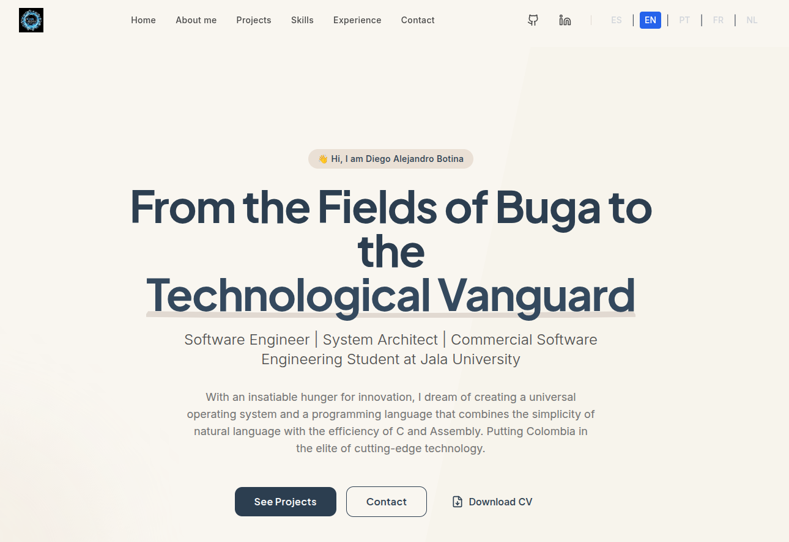

# Portfolio CodeWithBotina

¡Bienvenido al código fuente de mi portafolio personal! Este proyecto muestra mis habilidades, experiencia y los proyectos en los que he trabajado. Está diseñado para ser rápido, moderno y totalmente gestionado a través de un CMS headless (Contentful).



## 🔗 Demo en Vivo

Puedes ver el portafolio en acción en [**portfolio.codewithbotina.com**](https://portfolio.codewithbotina.com) (este es un ejemplo, ajusta la URL a tu dominio).

## ✨ Características

-   **React con Vite:** Desarrollo de alta velocidad y un rendimiento de producción optimizado.
-   **TypeScript:** Código más seguro y mantenible.
-   **Tailwind CSS:** Un framework de CSS "utility-first" para un diseño rápido y personalizado.
-   **Framer Motion:** Animaciones fluidas y atractivas para una mejor experiencia de usuario.
-   **Contentful:** Todo el contenido (proyectos, experiencia, habilidades) se gestiona desde Contentful, lo que permite actualizaciones sin necesidad de tocar el código.
-   **Diseño Responsivo:** Totalmente adaptable a dispositivos móviles, tabletas y computadoras de escritorio.

## 🛠️ Tecnologías Utilizadas

-   **Frontend:** [React](https://react.dev/), [Vite](https://vitejs.dev/), [TypeScript](https://www.typescriptlang.org/)
-   **Estilos:** [Tailwind CSS](https://tailwindcss.com/)
-   **Animaciones:** [Framer Motion](https://www.framer.com/motion/)
-   **CMS:** [Contentful](https://www.contentful.com/)
-   **Iconos:** [Lucide React](https://lucide.dev/guide/packages/lucide-react)

## 🚀 Cómo Empezar

Sigue estos pasos para configurar y ejecutar el proyecto en tu entorno local.

### Prerrequisitos

-   [Node.js](https://nodejs.org/) (versión 18 o superior)
-   [pnpm](https://pnpm.io/) (o puedes usar `npm` o `yarn`)
-   Una cuenta de [Contentful](https://www.contentful.com/)

### 1. Clonar el Repositorio

```bash
git clone https://github.com/CodeWithBotinaOficial/portfolio-codewithbotina.git
cd portfolio-codewithbotina
```

### 2. Instalar Dependencias

```bash
npm install
```

### 3. Configurar Variables de Entorno

Este proyecto requiere credenciales de Contentful para obtener el contenido.

1.  Crea un archivo `.env.local` en la raíz del proyecto.
2.  Añade las siguientes variables con tus credenciales de Contentful:

    ```env
    # Credenciales de Contentful
    VITE_CONTENTFUL_SPACE_ID="TU_SPACE_ID"
    VITE_CONTENTFUL_ACCESS_TOKEN="TU_ACCESS_TOKEN"
    ```

    Puedes encontrar estas claves en tu espacio de Contentful, en **Settings > API keys**.

### 4. Ejecutar el Servidor de Desarrollo

Una vez configuradas las variables de entorno, puedes iniciar el servidor de desarrollo.

```bash
npm run dev
```

Abre [http://localhost:5173](http://localhost:5173) (o el puerto que indique Vite) en tu navegador para ver el proyecto.

## 📜 Scripts Disponibles

-   `npm run dev`: Inicia el servidor de desarrollo de Vite.
-   `npm run build`: Compila el proyecto para producción (usa TypeScript y Vite).
-   `npm run lint`: Ejecuta ESLint para analizar el código en busca de errores y problemas de estilo.
-   `npm run preview`: Sirve localmente el build de producción para previsualizarlo.

## ☁️ Despliegue

Este proyecto está configurado para un despliegue sencillo en plataformas de Jamstack como [Cloudflare Pages](https://pages.cloudflare.com/), [Vercel](https://vercel.com/) o [Netlify](https://www.netlify.com/).

Para obtener una guía detallada sobre cómo desplegar este sitio en Cloudflare Pages, consulta el archivo [**DEPLOY_CLOUDFLARE.md**](./DEPLOY_CLOUDFLARE.md).