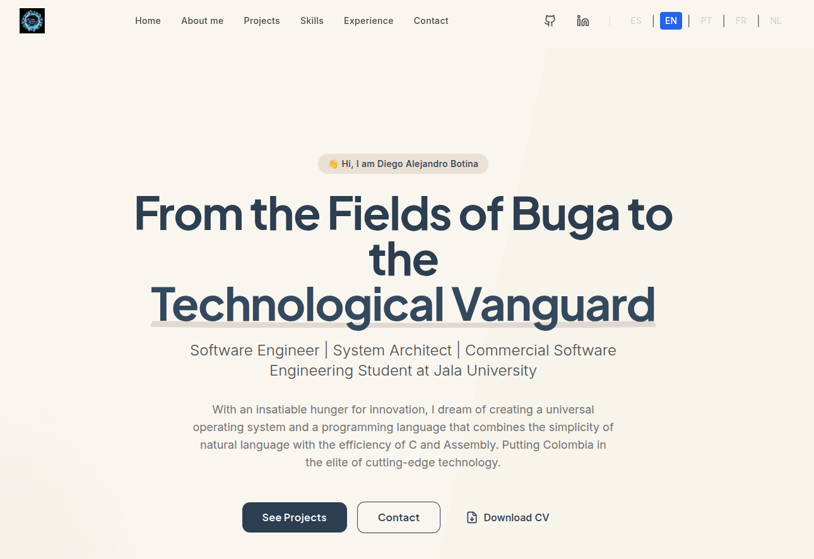

# Portafolio CodeWithBotina

¡Bienvenido a mi portafolio personal! Este proyecto muestra mis habilidades y experiencia como desarrollador de software. Aquí encontrarás información sobre mí, los proyectos en los que he trabajado y las tecnologías que domino.



## ✨ Características

-   **Diseño Moderno y Responsivo**: Una interfaz de usuario limpia y adaptable a cualquier tamaño de pantalla, construida con Tailwind CSS.
-   **Componentes Reutilizables**: Desarrollado con React y TypeScript, siguiendo una arquitectura basada en componentes para facilitar el mantenimiento y la escalabilidad.
-   **Gestión de Contenido**: El contenido del portafolio (proyectos, experiencia, etc.) se gestiona a través de Contentful, lo que permite actualizaciones sencillas sin necesidad de modificar el código.
-   **Internacionalización (i18n)**: Soporte completo para Español (`es`), Inglés (`en`), Portugués (`pt`) y Francés (`fr`) utilizando `i18next` y la localización nativa de Contentful.
-   **Animaciones Fluidas**: Uso de Framer Motion para animaciones sutiles que mejoran la experiencia de usuario.
-   **Optimizado para el Rendimiento**: Construido con Vite para un desarrollo rápido y un empaquetado optimizado para producción.

## 🚀 Tecnologías Utilizadas

-   **Frontend**:
    -   [React](https://reactjs.org/)
    -   [TypeScript](https://www.typescriptlang.org/)
    -   [Vite](https://vitejs.dev/)
    -   [React Router](https://reactrouter.com/)
    -   [i18next](https://www.i18next.com/)
    -   [Tailwind CSS](https://tailwindcss.com/)
    -   [Framer Motion](https://www.framer.com/motion/)
-   **CMS**:
    -   [Contentful](https://www.contentful.com/)
-   **Despliegue**:
    -   [Cloudflare Pages](https://pages.cloudflare.com/)

## 🌐 Internacionalización (i18n)

El sitio utiliza una estrategia de enrutamiento basado en rutas (`/es`, `/en`, `/pt`, `/fr`).

### Idiomas Soportados

| Locale | Idioma | Contentful locale | Estado |
|--------|--------|-------------------|--------|
| es | Español | es-CO | ✅ Completo |
| en | English | en-US | ✅ Completo |
| pt | Português (Brasil) | es-CO (fallback) | ⚠️ Solo UI |
| fr | Français | es-CO (fallback) | ⚠️ Solo UI |

### Configuración de Contentful
Para habilitar la localización en Contentful:
1. Asegúrate de tener los locales `en-US` y `pt-BR` configurados en tu espacio.
2. Ejecuta el script de configuración para marcar los campos como localizables:
   ```bash
   npm run setup:contentful-locales
   ```
   *Nota: Necesitarás un `CONTENTFUL_MANAGEMENT_TOKEN` en tu `.env.local`.*

### Agregar un nuevo idioma
Consulte la [Guía para Agregar un Nuevo Idioma](./docs/ADDING_NEW_LANGUAGE.md) para obtener instrucciones detalladas.

## 🛠️ Instalación y Uso Local

Para ejecutar este proyecto en tu entorno local, sigue estos pasos:

1.  **Clona el Repositorio**:
    ```bash
    git clone https://github.com/CodeWithBotinaOficial/portfolio-codewithbotina.git
    cd portfolio-codewithbotina
    ```

2.  **Instala las Dependencias**:
    ```bash
    npm install
    ```

3.  **Configura las Variables de Entorno**:
    Crea un archivo `.env.local` en la raíz del proyecto y añade tus credenciales de Contentful:
    ```env
    VITE_CONTENTFUL_SPACE_ID=tu_space_id
    VITE_CONTENTFUL_ACCESS_TOKEN=tu_access_token
    CONTENTFUL_MANAGEMENT_TOKEN=tu_management_token (opcional, para scripts)
    ```

4.  **Ejecuta el Servidor de Desarrollo**:
    ```bash
    npm run dev
    ```
    Abre [http://localhost:5173](http://localhost:5173) en tu navegador para ver el proyecto.

##  Scripts Disponibles

En el archivo `package.json` encontrarás los siguientes scripts:

-   `npm run dev`: Inicia el servidor de desarrollo de Vite.
-   `npm run build`: Compila el proyecto para producción.
-   `npm run lint`: Ejecuta ESLint para analizar el código.
-   `npm run test`: Ejecuta los tests unitarios con Jest.
-   `npm run setup:contentful-locales`: Configura la localización en tu espacio de Contentful.
-   `npm run preview`: Sirve el build de producción localmente para previsualización.
-   `npm run deploy`: Despliega el proyecto en Cloudflare Pages.

## 📄 Licencia

Este proyecto está bajo la Licencia MIT. Consulta el archivo `LICENSE` para más detalles.
